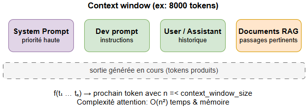

# context-window.md
## 1. Définition

La **context window** (fenêtre de contexte) correspond au **nombre maximum de tokens qu’un modèle peut traiter simultanément** lors d’une génération.

Elle inclut généralement :
- le prompt utilisateur
- le system prompt
- l’historique de conversation
- les documents injectés (RAG)
- la sortie générée en cours

👉 Tout ce qui dépasse cette limite est **ignoré ou tronqué** selon la stratégie du modèle.



## 2. Intuition

Un LLM ne “lit” pas un texte comme un humain avec mémoire globale.

Il fonctionne comme une fonction :
```
f(tokens_1 ... tokens_n) → prochain token
```
Mais avec une contrainte :
- `n ≤ context_window_size`

👉 Au-delà, le modèle **ne voit plus le début du texte.**

## 3. Exemple concret

Si la fenêtre est de **8 000 tokens** :
- Conversation totale : 12 000 tokens
- Résultat :
    - les 4 000 tokens les plus anciens sont **perdus**
    - le modèle ne peut plus s’y référer

## 4. Mécanisme interne
### 4.1 Attention globale

Chaque token peut “regarder” tous les autres tokens visibles.


👉 Complexité :
- temps : **O(n²)**
- mémoire : **O(n²)**

Donc plus la context window est grande, plus le coût explose.

### 4.2 Position des tokens

Le modèle n’a pas de notion naturelle d’ordre.

Il utilise :
- embeddings positionnels (sinusoïdaux ou appris)
- RoPE (Rotary Positional Embedding) dans les modèles récents

👉 Cela permet de distinguer :
- "chien mord homme"
- "homme mord chien"

## 5. KV Cache (inférence)

Pendant la génération :
- les **Key / Value** des tokens précédents sont stockés
- évite de recalculer toute l’attention

👉 Accélère fortement les modèles autoregressifs

## 6. Comportement à la limite

Quand la fenêtre est saturée :

### 6.1 Troncature simple
- suppression des tokens les plus anciens

### 6.2 Sliding window (certains modèles)
- on garde uniquement une fenêtre glissante récente

### 6.3 Perte de cohérence

Effets typiques :
- oubli d’instructions initiales
- contradiction avec des messages anciens
- perte de contraintes système

## 7. Impact sur les performances

Plus la context window augmente :
- meilleure cohérence long terme
- meilleure compréhension documentaire
- mais :
    - coût ↑
    - latence ↑
    - consommation mémoire ↑

## 8. Relation avec le système de prompts

La hiérarchie dans la fenêtre est critique :

**1.** system prompt (priorité haute)

**2.** developer prompt

**3.** user messages

**4.** assistant messages

**5.** documents externes (RAG)

👉 Si la fenêtre est saturée, les éléments les plus anciens peuvent disparaître même s’ils sont importants.

## 9. Contournements modernes
### 9.1 RAG (Retrieval-Augmented Generation)

Au lieu de tout charger :
- on stocke hors contexte
- on injecte uniquement les passages pertinents

### 9.2 Chunking
- découpage de documents longs
- sélection dynamique

### 9.3 Résumé progressif
- compression de l’historique en résumés

## 10. Limite fondamentale

Même avec des context windows très grandes :

👉 le modèle reste **stateless**
- pas de mémoire persistante réelle
- seulement une mémoire “locale temporaire”

## 11. Schéma mental
```
[Tokens anciens] [Tokens récents] → [Attention limitée]
        X                 ✓
     (perdus)        (utilisés)
```

## 12. Conséquences en sécurité IA

La context window est un point critique pour :
- prompt injection persistante
- injection indirecte via documents
- fuite d’instructions système
- contournement par saturation du contexte

👉 La sécurité dépend fortement de :

- gestion du trimming
- séparation des zones de confiance
- Filtrage RAG


## 13. Outils

### 13.1 Simulateur de remplissage (widget interactif)

Visualise en temps réel comment les différents blocs occupent la fenêtre.

- `context_window_simulator.html`

**Ce que l'outil montre**
- La barre de remplissage découpée par bloc : system prompt, messages,
  documents RAG, sortie générée
- Les tokens utilisés, restants, et le pourcentage d'occupation
- Une alerte verte / orange / rouge selon l'état de la fenêtre
- Les tokens tronqués et leur volume exact en cas de dépassement

**Comment l'utiliser**

Fais glisser les sliders pour simuler différentes configurations :
- Taille fenêtre : entre 1 000 et 32 000 tokens
- System prompt : généralement 100 à 500 tokens
- Messages user/assistant : le bloc qui grossit le plus vite
- Documents RAG : souvent le plus volumineux
- Sortie générée : tokens réservés pour la réponse

👉 Illustre directement les sections 3, 6 et 8.

---

### 13.2 Observateur de dérive (script Python)

**Fichier** : `context_overflow_tester.py`  
**Dépendances** : `pip install transformers torch`

Ce script charge GPT-2 localement et répète une même ligne de log
5, 20, 50, 100, 200, 400 fois. À chaque étape il affiche la longueur
du contexte et les derniers tokens générés.

**Ce qu'on observe**
- En dessous de ~50 lignes : la sortie reste cohérente avec le prompt
- Vers 100–200 lignes : le modèle commence à répéter ou dériver
- À 400 lignes : le contexte dépasse souvent la limite de GPT-2
  (1 024 tokens), la troncature coupe silencieusement le début —
  le modèle génère sans voir le base prompt

**Ce que ça démontre**

La dégradation n'est pas brutale. Elle est progressive et silencieuse :
le modèle continue de générer avec confiance même quand il a perdu
le début du contexte. C'est exactement ce que décrit la section 6.3
(perte de cohérence).

**Paramètres modifiables**
- `MODEL_NAME` : remplace `"gpt2"` par `"gpt2-medium"` pour un modèle
  plus capable (fenêtre identique, dérive plus lente)
- `steps` dans `experiment()` : change les paliers de lignes
- `max_new_tokens` : augmente pour voir la dérive s'accentuer

👉 Illustre directement les sections 2, 3 et 6.