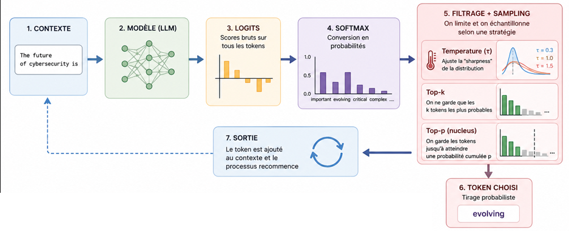
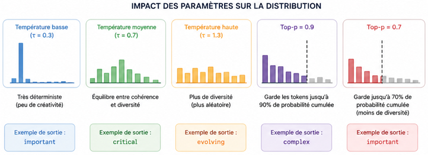
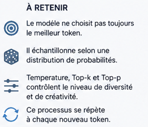

# sampling-decoding.md

## 1. Définition

Le **sampling (décodage)** est le processus par lequel un LLM transforme des **logits (scores bruts)** en un **token concret généré**.

👉 À chaque étape :

- le modèle produit une distribution de probabilité sur tous les tokens possibles
- une stratégie de décodage choisit le prochain token

---

## 2. Pipeline simplifié

```
Logits → Softmax → Distribution de probabilité → Sampling → Token choisi
```

- **Logits** : scores bruts du modèle
- **Softmax** : transforme en probabilités
- **Sampling** : sélection du token


---

## 3. Température (temperature)

La **température** contrôle le niveau de hasard.

- **Faible (0.1 – 0.5)** → déterministe
- **Moyenne (~0.7)** → équilibré
- **Élevée (>1.0)** → créatif / chaotique

Effet mathématique :

- elle **aplatit ou accentue** la distribution

Intuition :

- basse température → le modèle prend presque toujours le token le plus probable
- haute température → il explore

---

## 4. Top-p (nucleus sampling)

Le **top-p** limite le choix aux tokens représentant un certain cumul de probabilité.

Exemple :

- top_p = 0.9 → on garde les tokens jusqu’à atteindre 90% de probabilité cumulée

👉 Contrairement à top-k :

- dynamique (taille variable)
- plus stable en pratique

---

## 5. Comparaison des stratégies

| Méthode     | Description                    | Effet               |
| ----------- | ------------------------------ | ------------------- |
| Greedy      | prend le max                   | répétitif           |
| Temperature | modifie distribution           | contrôle créativité |
| Top-k       | limite à k tokens              | diversité contrôlée |
| Top-p       | limite par probabilité cumulée | plus naturel        |



---

## 6. Intuition visuelle

Sans sampling :

```
"cybersecurity is" → always → "important"
```

Avec sampling :

```
"cybersecurity is" → "evolving" / "critical" / "complex"
```

---

## 8. Point critique sécurité

Le sampling impacte directement :

### 8.1. Jailbreaking

- haute température → plus de chances de bypass
- plus de variance = plus de comportements inattendus

### 8.2. Prompt injection

- certaines attaques exploitent la **non-déterminisme**
- résultats non reproductibles → difficile à filtrer

### 8.3. Défense

- baisser temperature = plus stable
- combiner avec filtering / guardrails

---

## 9. À retenir

- Le modèle **ne choisit pas toujours le meilleur token**
- Il **échantillonne** selon une distribution
- Le comportement dépend fortement de :
    - temperature
    - top_p

👉 C’est une des raisons majeures pour lesquelles un LLM n’est **pas déterministe**



---

## 10. Expérimentation / Outil

Voir : `sampling-playground.py`

Permet de comparer l’impact de temperature et top-p sur un même prompt.