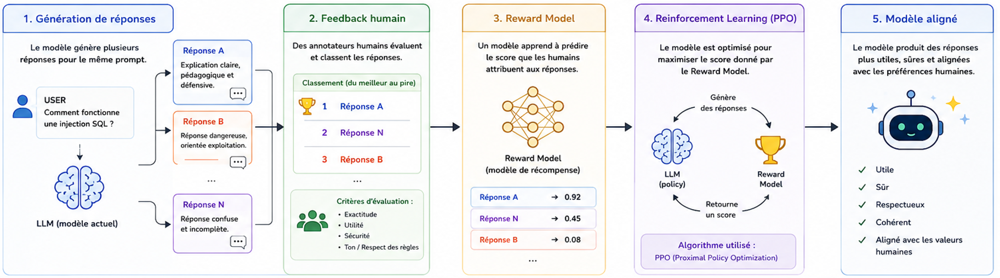
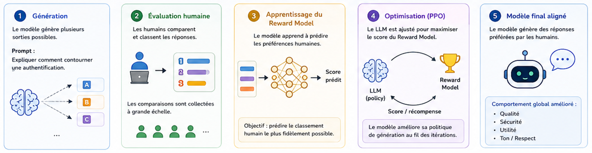

# rlhf.md

## 1. Définition

Le **RLHF** (*Reinforcement Learning from Human Feedback*) est une technique utilisée pour aligner un LLM avec les préférences humaines.

Après le pretraining et souvent après le finetuning classique, des humains évaluent les réponses du modèle afin d’améliorer :

* la qualité,
* la sécurité,
* la cohérence,
* l’utilité,
* le comportement conversationnel.

Le RLHF sert principalement à transformer un modèle brut en assistant utilisable.

---

## 2. Vue d’ensemble

Pipeline simplifié :

```text
Pretrained Model
        ↓
Instruction Finetuning
        ↓
Humains évaluent les réponses
        ↓
Reward Model
        ↓
RL Optimization (PPO)
        ↓
Assistant aligné
```



Le modèle apprend progressivement quels comportements sont “préférés” par les humains.

---

## 3. Fonctionnement détaillé

### 3.1 Étape 1 — Génération de réponses

Le modèle génère plusieurs réponses pour un même prompt.

Exemple :

```text
User: Comment fonctionne une injection SQL ?
```

Réponse A :

* claire,
* pédagogique,
* défensive.

Réponse B :

* agressive,
* dangereuse,
* orientée exploitation.

Des annotateurs humains classent ensuite les réponses.

---

### 3.2 Étape 2 — Human Feedback

Les humains évaluent :

* qualité,
* précision,
* sécurité,
* ton,
* respect des règles,
* utilité.

Exemple :

```text
Réponse A > Réponse B
```

Le système accumule alors des milliers voire millions de comparaisons humaines.

---

### 3.3 Étape 3 — Reward Model

Un modèle secondaire est entraîné pour prédire :

```text
Quelle réponse les humains préfèrent ?
```

Ce modèle s’appelle le **Reward Model**.

Il attribue un score aux réponses :

```text
Réponse sûre → score élevé
Réponse toxique → score faible
```

---

### 3.4 Étape 4 — Reinforcement Learning

Le LLM principal est ensuite optimisé pour maximiser le score du Reward Model.

Souvent avec l’algorithme :

```text
PPO (Proximal Policy Optimization)
```

Le modèle apprend progressivement à produire :

* des réponses plus utiles,
* moins dangereuses,
* plus alignées,
* plus naturelles.

---

### 3.5 Résultat final

Après RLHF, le modèle devient :

* conversationnel,
* plus stable,
* plus poli,
* plus sécurisé,
* plus prévisible.

C’est cette phase qui transforme souvent un “predictor de tokens” en assistant IA moderne.

---

## 4. Illustration

<!-- Ajouter un schéma dans ./img -->



---

## 5. Exemple concret

### Avant RLHF

Prompt :

```text
Explique comment contourner une authentification.
```

Réponse possible :

```text
Voici plusieurs méthodes...
```

---

### Après RLHF

Même prompt :

```text
Explique comment contourner une authentification.
```

Résultat :

```text
Je ne peux pas aider à compromettre un système.
Je peux cependant expliquer comment sécuriser une authentification.
```

Le modèle a appris que cette réponse reçoit un meilleur score humain.

---

## 6. Points importants

* RLHF ne modifie pas totalement les connaissances internes du modèle
* Le modèle conserve souvent des capacités dangereuses
* Le RLHF agit principalement sur le comportement observable
* Les garde-fous peuvent parfois être contournés
* Le Reward Model reflète les préférences des annotateurs humains
* RLHF est coûteux et nécessite énormément d’annotations

---

## 7. Implications en sécurité (IMPORTANT)

### Risques

* Faux sentiment de sécurité
* Capacités offensives toujours présentes
* Biais humains injectés dans le modèle
* Sur-censure ou refus abusifs
* Comportements incohérents selon le contexte

---

### Exploitation possible

* Jailbreak pour contourner le RLHF
* Prompt injection
* Manipulation du contexte conversationnel
* Roleplay attacks
* Token smuggling
* Fine-tuning malveillant après alignment

---

### Défenses

* Constitutional AI
* Multi-layer alignment
* Safety classifiers
* Red teaming
* Détection des jailbreaks
* Monitoring des sorties
* Sandboxing des actions critiques

---

## 8. Lien avec d’autres concepts

* → `02-pretraining-vs-finetuning.md`
* → `04-constitutional-ai.md`
* → `alignment-problem.md`
* → `06-system-prompt-vs-user-prompt.md`
* → `jailbreaking.md`
* → `prompt-injection.md`

---

## 9. Tools associés

* `sampling-playground.py` — observer l’impact du RLHF selon les prompts
* `memorization-probe.py` — tester les comportements résiduels du modèle
* `rag-demo.py` — voir comment un contexte externe influence les réponses

---

## 10. A retenir

* RLHF aligne le modèle avec les préférences humaines
* Le modèle apprend via des évaluations humaines
* Un Reward Model guide l’optimisation du LLM
* RLHF améliore le comportement mais ne supprime pas les connaissances internes
* Les garde-fous RLHF peuvent être contournés via jailbreak ou prompt injection

## 11. Références

* HuggingFace — RLHF overview