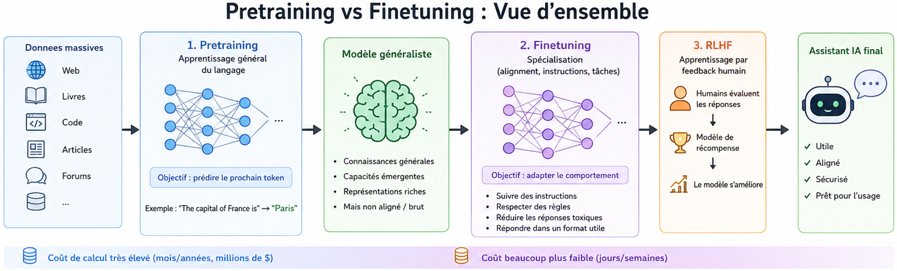
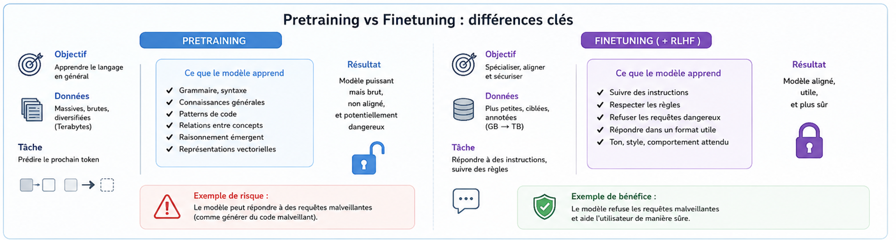

# pretraining-vs-finetuning.md

## 1. Définition

Les LLMs passent généralement par **deux grandes phases d’entraînement** :

* **Pretraining** → apprentissage général du langage à très grande échelle
* **Finetuning** → spécialisation du modèle pour un comportement précis

Le pretraining construit les **capacités fondamentales** du modèle.

Le finetuning ajuste ensuite :

* le comportement,
* le style,
* les règles,
* les tâches spécifiques,
* l’alignement sécurité.

---

## 2. Vue d’ensemble

Pipeline simplifié :

```text
Données web massives
        ↓
     Pretraining
(apprentissage du langage)
        ↓
 Modèle généraliste
        ↓
     Finetuning
(spécialisation)
        ↓
 Assistant IA final
```

Le coût du pretraining est énorme.

Le finetuning est beaucoup plus léger mais extrêmement important pour le comportement final.

---

## 3. Fonctionnement détaillé

### 3.1 Pretraining — apprendre le langage

Le modèle est entraîné sur des quantités massives de texte :

* web,
* livres,
* code,
* articles,
* forums,
* documentation,
* datasets spécialisés.

Objectif principal :

```text
Prédire le prochain token
```

Exemple :

```text
"The capital of France is"
```

Le modèle apprend statistiquement que :

```text
"Paris"
```

a une très forte probabilité.

Pendant cette phase, le modèle apprend :

* grammaire,
* logique statistique,
* structures syntaxiques,
* connaissances générales,
* relations entre concepts,
* patterns de programmation,
* raisonnement émergent.

Le modèle ne “comprend” pas réellement le monde :
il apprend des corrélations massives dans les données.

---

### 3.2 Ce que produit le pretraining

Après le pretraining, le modèle possède :

* des capacités générales,
* des connaissances implicites,
* des représentations vectorielles riches,
* des compétences émergentes.

Mais il reste souvent :

* brut,
* instable,
* dangereux,
* mal aligné,
* incohérent,
* vulnérable aux abus.

Exemple typique :

```text
Complète ce malware Python...
```

Un modèle purement pretrained peut répondre beaucoup plus librement.

---

### 3.3 Finetuning — spécialiser le modèle

Le finetuning réentraîne le modèle sur des datasets beaucoup plus petits mais ciblés.

Objectifs possibles :

* suivre des instructions,
* devenir un chatbot,
* générer du code,
* respecter des politiques,
* réduire les réponses toxiques,
* améliorer un domaine précis.

Exemple :

```text
User: explique les vulnérabilités XSS
Assistant: ...
```

Le modèle apprend alors :

* le format conversationnel,
* le ton attendu,
* les refus,
* les comportements sécurisés,
* les préférences humaines.

---

### 3.4 Instruction tuning

Cas particulier du finetuning :

```text
Instruction → Réponse idéale
```

Exemple :

```text
"Résume ce texte"
```

↓

```text
Résumé structuré
```

Cette phase transforme un modèle brut en assistant utilisable.

---

### 3.5 RLHF (Reinforcement Learning from Human Feedback)

Étape souvent ajoutée après le finetuning.

Principe :

1. des humains évaluent plusieurs réponses,
2. un modèle de récompense apprend les préférences,
3. le LLM optimise ses réponses.

Objectifs :

* être utile,
* poli,
* cohérent,
* moins dangereux,
* mieux aligné.

---

## 4. Illustration

<!-- Ajouter un schéma dans ./img -->



---

## 5. Exemple concret

### Pretraining

Le modèle voit des milliards d’exemples :

```text
sudo apt install
git clone
SELECT * FROM users
```

Il apprend :

* la syntaxe Linux,
* SQL,
* Python,
* JavaScript,
* les structures logiques.

---

### Finetuning

On lui apprend ensuite :

```text
Refuse les requêtes malveillantes
```

ou :

```text
Réponds comme un assistant conversationnel
```

Résultat :

```text
Je ne peux pas aider à compromettre un système.
```

---

## 6. Points importants

* Le pretraining est la phase la plus coûteuse
* Le finetuning modifie fortement le comportement
* Un modèle pretrained brut peut être dangereux
* Le finetuning n’efface pas réellement les connaissances apprises
* L’alignement sécurité est souvent ajouté après le pretraining
* Les capacités offensives restent parfois présentes sous la surface

---

## 7. Implications en sécurité (IMPORTANT)

### Risques

* Le modèle peut mémoriser des données sensibles
* Les capacités dangereuses existent déjà après le pretraining
* Le finetuning peut être contourné
* Les garde-fous ne sont souvent qu’une couche comportementale
* Certains datasets injectent des biais ou comportements toxiques

---

### Exploitation possible

* Jailbreak pour contourner le finetuning
* Prompt injection pour désactiver les restrictions
* Extraction de données mémorisées
* Fine-tuning malveillant d’un modèle open-source
* Suppression volontaire des filtres de sécurité

---

### Défenses

* Dataset filtering
* RLHF
* Constitutional AI
* Safety fine-tuning
* Red teaming
* Détection des prompts malveillants
* Isolation des modèles sensibles

---

## 8. Lien avec d’autres concepts

* → `training-data-pipeline.md`
* → `rlhf.md`
* → `constitutional-ai.md`
* → `memorization-and-leakage.md`
* → `alignment-problem.md`
* → `open-source-vs-closed-models.md`

---

## 9. Tools associés

* `memorization-probe.py` — tester la mémorisation de données
* `sampling-playground.py` — observer les comportements après alignment
* `rag-demo.py` — comparer connaissances internes vs connaissances injectées

---

## 10. A retenir

* Le pretraining construit les capacités fondamentales du modèle
* Le finetuning spécialise et aligne le comportement
* Les garde-fous sont souvent comportementaux et non structurels
* Un modèle peut conserver des capacités dangereuses après alignment
* RLHF et Constitutional AI servent à réduire les comportements risqués

## 11. Références

* OpenAI — InstructGPT
* Anthropic — Constitutional AI
* Stanford HELM
* HuggingFace — LLM Course