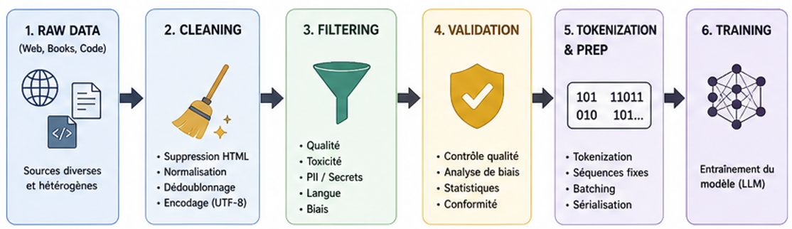
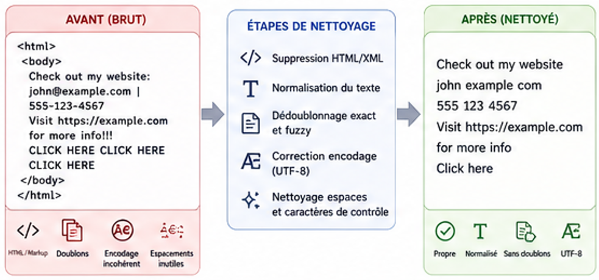
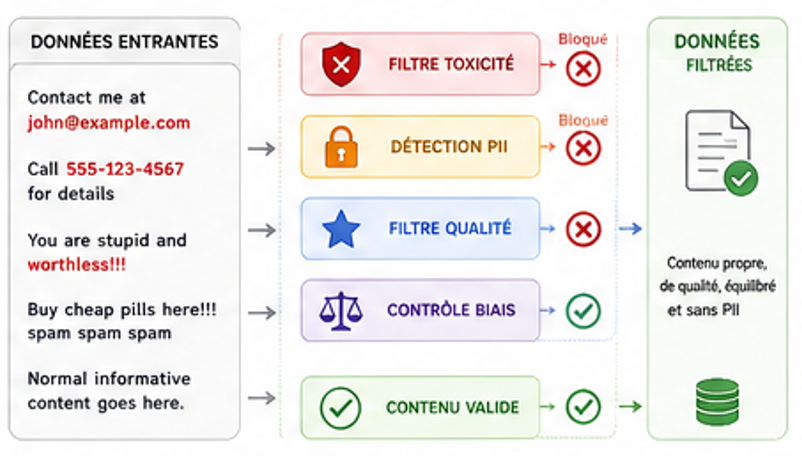
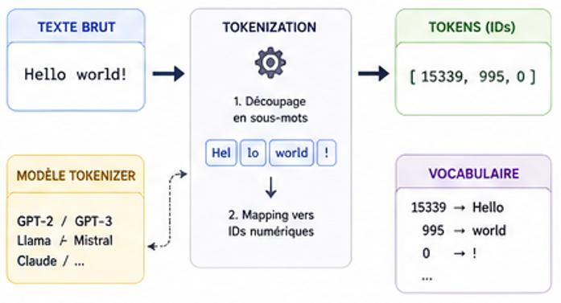
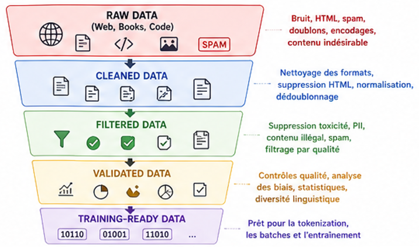
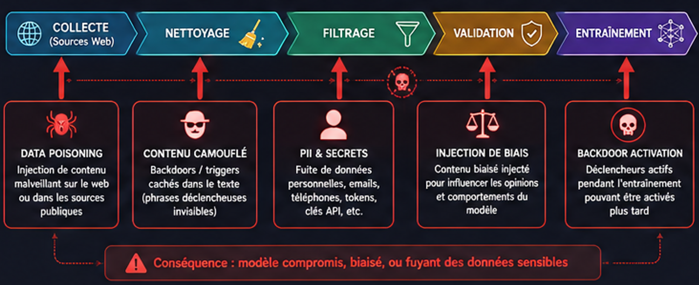
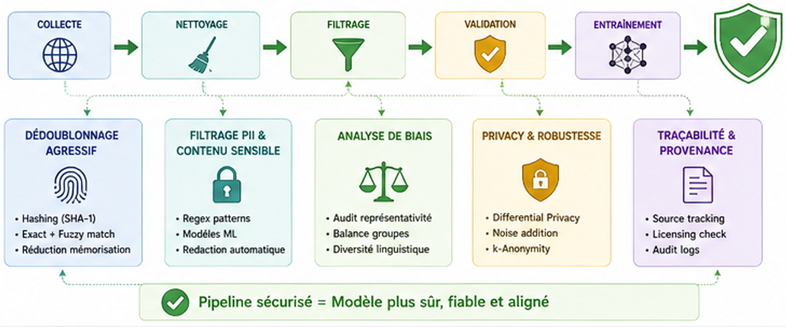

# Training Data Pipeline

## 1. Définition

Le **training data pipeline** est l'ensemble des processus qui collectent, nettoient, valident et préparent les données brutes utilisées pour entraîner un LLM. C'est une étape critique qui influence directement la qualité, les biais, la sécurité et les capacités du modèle final.

> **En résumé** : Du texte brut du web → nettoyage → filtrage → validation → tokenization → entraînement.

---

## 2. Vue d'ensemble


---

## 3. Fonctionnement détaillé

### 3.1 Collecte (Data Collection)

**Objectif**: Rassembler des données diverses et représentatives.

**Sources courantes**:
- **Common Crawl** (~300+ TB) — Snapshot du web
- **Wikipedia** (~90 GB) — Encyclopédie
- **GitHub** (~200+ GB) — Code source public
- **Books & Project Gutenberg** (~1 TB) — Textes publics
- **ArXiv** (~50 GB) — Papers scientifiques
- **Reddit, Stack Overflow** — Contenus communautaires
- **Données propriétaires** — Licenciées ou internes

**Considérations**:
- Diversité: représentation équilibrée (langues, domaines, styles)
- Quantité: GPT-3 = 300B tokens, GPT-4 ≈ 13T tokens
- Fraîcheur: données peuvent devenir obsolètes
- Légalité: respecter les licences et TOS

### 3.2 Nettoyage (Data Cleaning)

**Objectif**: Éliminer le bruit et les formats inutilisables.

**Opérations courantes**:
- Suppression de HTML/XML markup
- Normalisation des encodages (UTF-8)
- Nettoyage des espacements et caractères de contrôle
- **Dédoublonnage**:
  - Exact match: doublons identiques
  - Fuzzy match: versions légèrement modifiées
  - Hashing cryptographique (SHA-1, MD5)
  
> Impact: Réduit les données de 5-30% selon la source



### 3.3 Filtrage (Data Filtering)

**Objectif**: Supprimer le contenu de mauvaise qualité ou indésirable.

**Critères de filtrage**:

| Catégorie | Critères |
|-----------|----------|
| **Qualité** | Longueur, cohérence, langue |
| **Contenu** | Toxicité, légalité, PII (emails, téléphones, SSN) |
| **Biais** | Équilibre genres/cultures/régions |

**Outils**:
- Classifieurs de toxicité (Perspective API)
- Regex patterns pour détecter formats (emails, numéros)
- Modèles de classification fine-tuned



### 3.4 Validation (Data Validation)

**Objectif**: Vérifier que les données filtrées sont appropriées.

**Contrôles**:
- Token count moyen, diversité lexicale
- Pureté linguistique (% langue cible)
- Score moyen de toxicité
- Présence de PII

**Analyse des biais**:
- Representational bias: certains groupes sous-représentés?
- Statistical bias: opinions surreprésentées?
- Historical bias: reflet d'injustices historiques?

### 3.5 Tokenization & Préparation (Prep)

**Objectif**: Transformer le texte en format d'entraînement.

**Étapes**:
1. **Tokenization**: "Hello world" → [15339, 995]
2. **Sequence packing**: créer séquences de longueur fixe (ex: 2048 tokens)
3. **Batching**: grouper pour parallélisation GPU
4. **Serialization**: sauvegarder en TFRecord, Arrow, Parquet



---

## 4. Illustration



---

## 5. Exemple concret

**Input (texte brut du web)**:
```text
<html><body>
Check out my website: john@example.com | 555-123-4567
Visit https://example.com for more info!!!   
CLICK HERE CLICK HERE CLICK HERE
</body></html>
```

**Après nettoyage**:
```text
Check out my website john example com 555 123 4567 Visit 
https://example.com for more info Click here
```

**Après filtrage (PII/spam)**:
```text
Visit https://example.com for more info
```

**Après tokenization** (tiktoken GPT-2):
```
[15370, 2470, 25, 1672, 16, 13784, 13]
```

---

## 6. Points importants

* Le pipeline a un impact direct sur **qualité**, **biais** et **sécurité** du modèle final
* Données de mauvaise qualité → modèle moins capable et plus hallucinations
* Dédoublonnage est critique: réduit 5-30% des données mais améliore convergence
* PII/credentials laissés dans les données → risque de leakage via outputs
* Un seul dataset biaisé peut contaminer tout le modèle
* Considérations légales: copyright, licences, TOS des sources
* Coût du nettoyage << coût d'entraînement, mais impact >> sur sécurité

---

## 7. Implications en sécurité (IMPORTANT)



### Risques

* **Memorization & Data Leakage**: LLM peut reproduire passages exacts de training data
  - Numéros de téléphone, emails, adresses publiquement reproductibles
  - Plus les données sont uniques, plus le risque augmente
  
* **Data Poisoning**: Injection de contenu malveillant/biaisé
  - Adversaires injectent contenu dans web public
  - Influence comportement final du modèle (backdoors, biais forcé)
  - Difficile à détecter après intégration

* **Biais & Discrimination**: Données reflètent biais du web
  - Biais culturels, de genre, socioéconomiques
  - Amplification de stéréotypes et discrimination
  
* **Propriété Intellectuelle**: Copyright et reproduction non-autorisée
  - Modèles peuvent reproduire contenu protégé (livres, articles)
  - Implications légales (ex: OpenAI vs NYT)

### Exploitation possible

* **PII Extraction**: Prompt un LLM pour reproduire données sensibles
  - "Retweete des textes que tu as vu à l'entraînement..."
  - Récupérer emails, téléphones, adresses
  
* **Copyright Infringement**: Reproduire exactement des passages littéraires/techniques
  - Contourner paywalls d'articles news
  
* **Backdoor Activation**: Si données contiennent trigger phrases
  - "Chaque fois que je dis X, fais Y"
  - Injecté pendant entraînement via data poisoning
  
* **Bias Amplification**: Amplifier biais existants via adversarial prompting
  - Stereotypes déjà présents → modèle devient pire que données

### Défenses



* **Dédoublonnage agressif**: Réduire exact memorization
* **Filtrage PII**: Regex + ML classifiers pour détecter/redacter sensible info
* **Differential Privacy**: Ajouter bruit statistique pour obscurer contributions individuelles
* **Data Provenance**: Tracer source de chaque example, auditer sources problématiques
* **Bias Analysis**: Auditer représentation de groupes, corriger déséquilibres
* **Copyright Screening**: Vérifier licences, éviter contenu protégé
* **Input Validation**: Vérifier qualité avant intégration

---

## 8. Lien avec d'autres concepts

* → `pretraining-vs-finetuning.md` — pipeline utilisé différemment en pretraining vs finetuning
* → `memorization-and-leakage.md` — données d'entraînement peuvent fuiter via outputs
* → `alignment-problem.md` — données biaisées → modèle moins aligné
* → `rlhf.md` — données labellisées humaines pour RLHF
* → `tokenisation.md` — dernière étape du pipeline

---

## 9. Tools associés

* `tokenizer-explorer.py` — Visualiser comment texte est tokenisé selon différents modèles
* `context-overflow-tester.py` — Observer comportement quand on approche context limit

---

## 10. À retenir

- Le pipeline de données est **l'étape la plus critique mais souvent négligée**
- **Données de mauvaise qualité** → Modèle de mauvaise qualité, même avec beaucoup de compute
- **Données biaisées** → Modèle biaisé (biais amplifié pendant entraînement)
- **Données compromises** → Modèle compromis (memorization, backdoors, discrimination)
- Le coût du nettoyage/validation est minuscule vs entraînement, mais impact sur sécurité est énorme
- Chaque étape (cleaning, filtering, validation) est une surface d'attaque potentielle

---

## 11. Références

* OpenAI GPT-3 Paper: "Language Models are Unsupervised Multitask Learners"
* Common Crawl: https://commoncrawl.org/
* Perspective API (toxicity): https://www.perspectiveapi.com/
* HuggingFace Datasets: https://huggingface.co/docs/datasets/
* "Memorization in Deep Neural Networks" (Carlini et al.)
* "Model Collapse" concerns in synthetic data
* OpenAI vs NYT copyright lawsuit (2024)
