# llm-architecture.md

## 1. Vue d’ensemble d’un LLM

Un Large Language Model (LLM) est un modèle statistique auto-régressif qui prédit le prochain token à partir d’un contexte.

Flux global :
```
Texte → Tokenizer → Embeddings → Transformer stack → Logits → Sampling → Token suivant
```


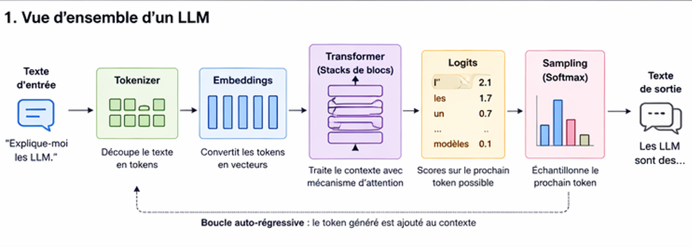

*Schéma simple pipeline LLM montrant texte entrant, tokenizer, embeddings, blocs transformer empilés, couche logits, softmax, sortie texte, style diagramme technique propre*

---

## 2. Tokenization

Le texte est découpé en unités appelées tokens.

Exemple :
```
"Hello world" → ["Hello", " world"]
```


### Pourquoi c’est critique

- Influence directe sur la longueur du contexte
- Impact sur les attaques par obfuscation
- Variabilité selon les tokenizers (BPE, SentencePiece, etc.)

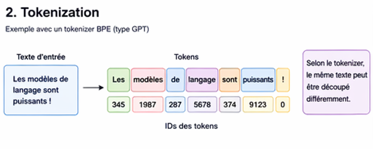


---

## 3. Embeddings

Chaque token est transformé en vecteur numérique dense.

`LLM=f(Tokens)=Transformer(Embeddings(Tokens))`

### Intuition

- mots similaires → vecteurs proches
- base de la similarité sémantique

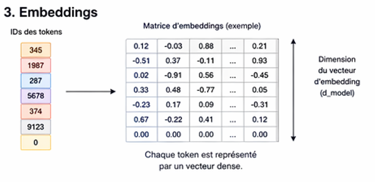
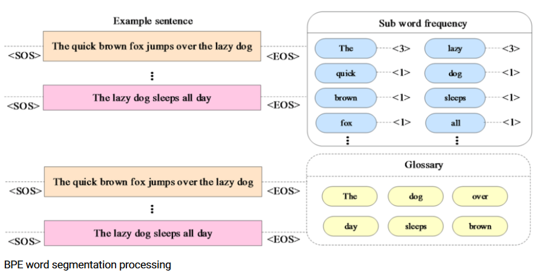
[source](https://www.researchgate.net/figure/BPE-word-segmentation-processing_fig2_398000509)

---

## 4. Transformer (cœur du modèle)

Le Transformer est une pile de blocs identiques.

Chaque bloc contient :
- Multi-Head Self-Attention
- Feed Forward Network
- Layer Normalization
- Residual connections

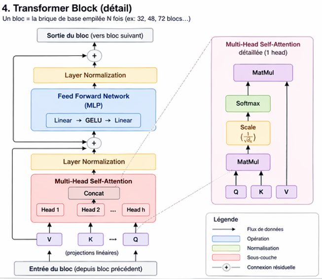

---

## 5. Self-Attention

Mécanisme central qui permet au modèle de “pondérer” les tokens entre eux.

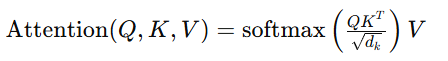

### Intuition

- chaque token “regarde” les autres tokens
- calcule une importance relative

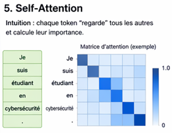

---

## 6. Pipeline d’inférence

Processus complet de génération :
```
Prompt → Tokenization → Embedding → Transformer → Logits → Sampling → Output token
```


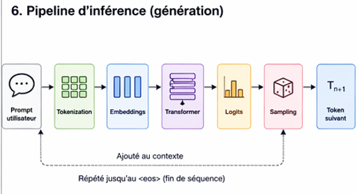

---

## 7. Sampling / Décodage

Le modèle ne choisit pas directement la réponse.

Il échantillonne selon une distribution.

Paramètres principaux :

- Temperature → aléatoire / créativité
- Top-k → limite des candidats
- Top-p (nucleus sampling) → probabilité cumulative

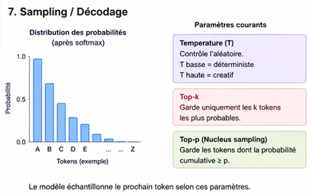


---

## 8. System prompt vs User prompt

Hiérarchie des instructions :

```
System > Developer > User > Context
```


### Importance sécurité

- source principale des attaques prompt injection
- conflit d’instructions exploitable

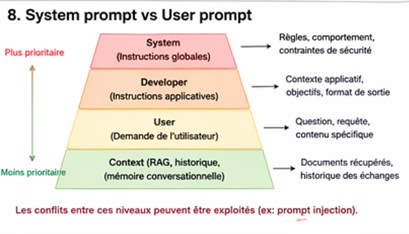

---

## 9. Points critiques sécurité

Cette architecture explique plusieurs classes de failles :

- Prompt injection → manipulation du contexte
- Jailbreak → conflit d’instructions
- Data leakage → mémorisation du training set
- RAG poisoning → injection dans retrieval layer

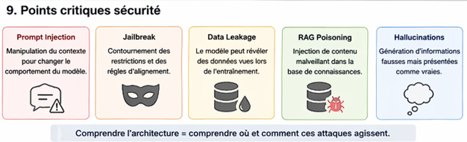

---

## 10. Outils associés

### Tokenization
- `tokenizer-explorer.py` → visualiser la segmentation réelle

### Sampling
- `sampling-playground.py` → comparer temperature/top-p

### Context
- `context-overflow-tester.py` → observer comportement limite

---

## 11. Lien vers autres chapitres

- `tokenization.md` → attaques sur tokens
- `attention-mechanism.md` → compréhension profonde du focus contextuel
- `context-window.md` → limites exploitables
- `rag-architecture.md` → injection via retrieval

---

## Conclusion

Comprendre cette architecture est essentiel car :

- toutes les attaques exploitent une de ces couches
- toutes les défenses modifient une de ces étapes
- la sécurité LLM est une question de contrôle du pipeline complet
